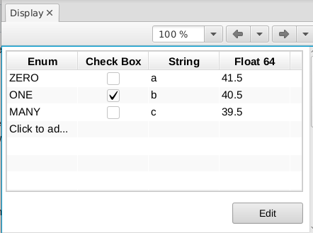

NTTable (and NTEnum) proposals
==============================

As part of a project to support a PandABox in Bluesky, we are writing a
pythonSoftIOC to allow control of all parameters. PandA provides types, values
and metadata for each of these parameters, most of which map to existing record
types, with the following exceptions:

- Enums with 128 entries and 30 character strings
- Table columns with units, precision and limits
- Table columns which are Enums
- Descriptions on everything

This repo contains some QSRV and P4P experiments that prototype extensions to
normative types that allow these features to be expressed over PVA.

Installation Instructions
-------------------------

To run any of the examples below, do the following:

    $ git clone https://github.com/thomascobb/nt_table_test.git
    $ cd nt_table_test
    $ pipenv install

Enums with 128 entries and 30 character strings
-----------------------------------------------

This was the first requirement that pushed us from CA to PVA. This can be done
at the moment with QSRV or P4P, although QSRV needs
https://github.com/epics-base/pva2pva/issues/47 to allow typeids to be added to
custom structures.

Table columns with units, precision and limits
----------------------------------------------

To allow these, I propose that there be a ``display_t`` per column to
hold this information. As QSRV already produces ``display_t`` with 
different type for ``limitLow`` and ``limitHigh`` based on the value type,
I propose this be a structure like ``value``

.. code-block::

    NTTable := 

    structure 
        string[]    labels      // The field names of each field in value
        structure   value       
            {scalar_t[] colname}0+
        structure   display       
            {display_t[] colname}0+
        string      descriptor    : opt
        alarm_t     alarm         : opt
        time_t      timeStamp     : opt

Table columns which are Enums
-----------------------------

The above addition to NTTable doesn't support enums, because the ``display_t``
doesn't contain the enum choices, instead embedding them into ``enum_t``. This
makes ``enum_t[]`` the wrong choice for a table column as it allows each enum to
have a different choices array. I propose that instead an enum column is of type
``uint`` (or ``ushort`` etc.) with the enum labels appearing in the
``display_t``. I also propose that some fields of ``display_t`` are made optional
so they do not need to be appear for scalar types that do not support them

.. code-block::

    display_t :=

    structure
        string description
        // The following only for enums
        string[] enumLabels      :opt        
        // The following only for numeric
        scalar_t limitLow        :opt
        scalar_t limitHigh       :opt 
        string units             :opt
        int precision            :opt
        enum_t form(3)           :opt
            int index
            string[] choices ["Default", "String", "Binary", "Decimal", "Hex", "Exponential", "Engineering"]    

Descriptions on everything
--------------------------

The ``display_t`` has a ``description``, but there are a number of ``descriptor``s
in the normative types spec. I don't know the difference, but it makes sense to me
that ``description`` belongs in ``display``. This is currently missing from
``NTEnum``, so I propose that we instead use an ``NTScalar<uint>`` instead 
with the above ``display_t`` addition of ``enumLabels``.

I note that the ``NTTable`` is missing a ``description``, but this could be 
added at the root of the structure, or an extra level added into the ``NTTable``
``display`` structure, although if I was doing that I'd move the labels there::

.. code-block::

    NTTable := 

    structure 
        structure   value       
            {scalar_t[] colname}0+
        structure   display       
            string      description
            string[]    labels      // The field names of each field in value
            structure   columns
                {display_t[] colname}0+
        string      descriptor    : opt
        alarm_t     alarm         : opt
        time_t      timeStamp     : opt    

This is probably too much of a breaking change however.

Example Enum output
-------------------

Running::

    $ pipenv run python ./nt_table_ioc.py 

The original enum gives ``pvget`` output::

    $ pvget -vv QSRV:OLD:ENUM
    QSRV:OLD:ENUM epics:nt/NTEnum:1.0 
        enum_t value (1) ONE
            int index 1
            string[] choices ["ZERO", "ONE", "MANY"]
        alarm_t alarm 
            int severity 0
            int status 0
            string message NO_ALARM
        time_t timeStamp 2021-11-12 15:24:03.841  
            long secondsPastEpoch 1636730643
            int nanoseconds 841079061
            int userTag 0

The new enum (with QSRV ``record`` field removed, and remaining fields reordered)::

    $ pvget -vv QSRV:NEW:ENUM
    QSRV:NEW:ENUM epics:nt/NTScalar:1.0 
        int value 1
        alarm_t alarm 
            int severity 0
            int status 0
            string message NO_ALARM
        time_t timeStamp 2021-11-12 15:23:54.313  
            long secondsPastEpoch 1636730634
            int nanoseconds 312931537
            int userTag 0
        structure display
            string description New Enum
            string[] enumLabels ["ZERO", "ONE", "MANY"]

Running::

    $ pipenv run python ./nt_table_p4p.py 

You get functionally equivalent output for ``pvget -vv P4P:OLD:ENUM`` and
``pvget -vv P4P:NEW:ENUM``.

Example Table output
--------------------

Running::

    $ pipenv run python ./nt_table_ioc.py 

The original table gives ``pvget`` output (with ``record`` field removed, and
remaining fields reordered)::
    
    $ pvget -vv QSRV:TABLE
    QSRV:TABLE epics:nt/NTTable:1.0 
        string[] labels ["Enum", "Check Box", "String", "Float 64"]
        structure value
            int[] c1 [0,1,2]
            int[] c2 [1,0,1]
            string[] c3 ["a", "b", "c"]
            double[] c4 [38.5,37.5,36.5]
        alarm_t alarm 
            int severity 0
            int status 0
            string message NO_ALARM
        time_t timeStamp 2021-11-12 15:32:40.907  
            long secondsPastEpoch 1636731160
            int nanoseconds 907351844
            int userTag 0

Running::

    $ pipenv run python ./nt_table_p4p.py 

You get functionally equivalent output for ``pvget -vv P4P:OLD:TABLE``, and for the
new table we get::

    $ pvget -vv P4P:NEW:TABLE
    P4P:NEW:TABLE epics:nt/NTTable:1.0 
        string[] labels ["Enum", "Check Box", "String", "Float 64"]
        structure value
            uint[] enum [0,1,2]
            boolean[] checkBox [false,true,false]
            string[] string ["a", "b", "c"]
            double[] float64 [77.5,76.5,75.5]
        string descriptor 
        alarm_t alarm 
            int severity 0
            int status 0
            string message 
        time_t timeStamp 2021-11-12 15:35:49.033  
            long secondsPastEpoch 1636731349
            int nanoseconds 33052444
            int userTag 0
        structure display
            display_t enum
                string description An enum column
                string[] enumLabels ["ZERO", "ONE", "MANY"]
            display_t checkBox
                string description A checkBox column
            display_t string
                string description A string column
            display_t float64
                string description A float64 column
                double limitLow 0
                double limitHigh 10000.5
                string units m
                int precision 1
                enum_t form (0) Default
                    int index 0
                    string[] choices ["Default", "String", "Binary", "Decimal", "Hex", "Exponential", "Engineering"]

Phoebus table screen
--------------------

At the moment, metadata can be added to columns of the table widget to allow
enums and checkboxes. With the above changes it would be possible to use the
metadata from the NTTable to populate these. I believe that the table widget
currently only accepts strings so I have to convert to these in an embedded
script::

    from org.csstudio.display.builder.runtime.script import PVUtil, ScriptUtil
    
    mode = PVUtil.getLong(pvs[0])
    table = PVUtil.getTable(pvs[1])
    
    if mode == 0:  # Displaying
      out = []
      column_props = widget.getPropertyValue("columns")
      for row in table:
        new_row = []
        for col, prop in zip(row, column_props):
          if not isinstance(col, (str, unicode)):
            options = prop.options()
            if options.size() > 0:
              col = options.getElement(col).value
            else:
              col = str(col)
          new_row.append(col)
        out.append(new_row)
      widget.setValue(out)
      widget.setPropertyValue("editable", False)
    elif mode == 1:  # Editing
      widget.setPropertyValue("editable", True)
    elif mode == 2:  # Submit
      pvs[0].write(0)
      # This doesn't currently work...
      pvs[1].write(widget.getValue())

When this is done we can see our NTTable (old or new):

This is discussed in more detail here:
https://github.com/ControlSystemStudio/phoebus/issues/1214